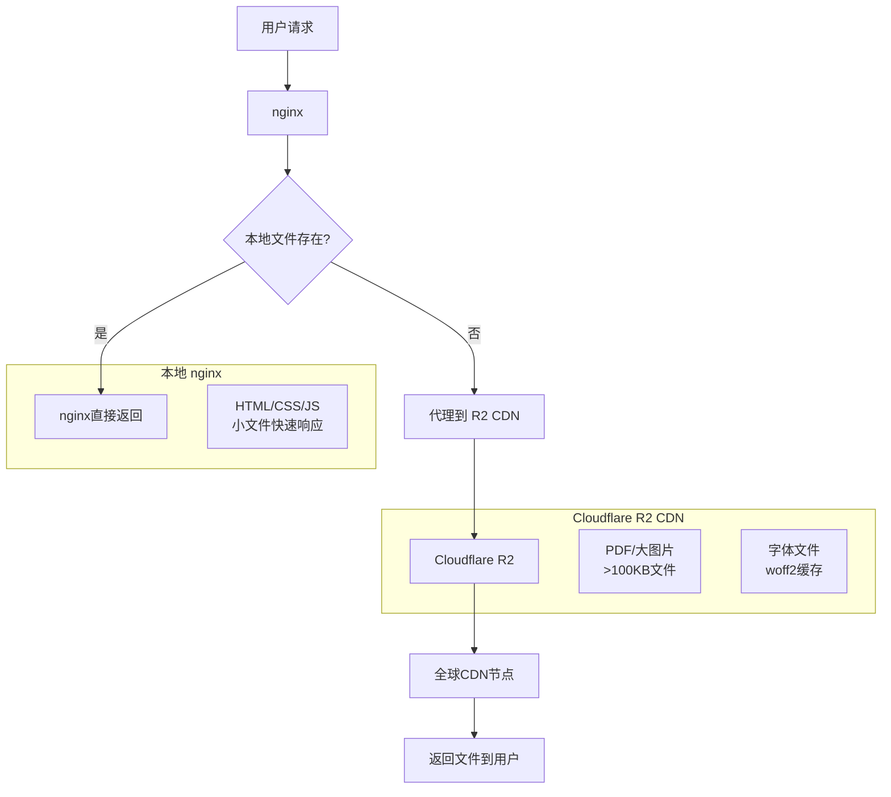

# 🌐 CDN架构详细说明

## 📋 架构概览

本项目采用了**智能混合CDN架构**，将 nginx 本地服务与 Cloudflare R2 全球 CDN 无缝结合，实现了高性能、低成本的静态资源分发方案。

## 🏗️ 技术架构图



## 🎯 文件分层策略

### 📊 分层规则

| 文件类型 | 大小阈值 | 存储位置 | 缓存策略 | 说明 |
|---------|---------|---------|----------|------|
| **HTML/CSS/JS** | 任意大小 | nginx本地 | 7天 | 频繁更新，本地响应快 |
| **PDF文档** | 任意大小 | R2 CDN | 1年 | 大文件，全球分发 |
| **大图片** | >100KB | R2 CDN | 30天 | 减少带宽消耗 |
| **小图标** | <100KB | nginx本地 | 30天 | 快速加载 |
| **字体文件** | 任意大小 | R2 CDN | 30天 | 跨页面复用 |

### 🔄 去重策略

通过 MD5 校验去除重复文件：

```python
# 相同MD5的文件只保留一份，优先级：
static/ > assets/ > public/
```

**去重成果**：
- 原始文件：269个
- 优化后：48个核心文件
- 节省存储：~80%

## ⚡ 性能优化

### 🚀 加载速度优化

1. **智能路由**
   ```nginx
   location ~* \.(pdf|jpg|png)$ {
       try_files $uri @r2_fallback;
   }
   ```

2. **缓存策略**
   - 本地缓存：7-30天
   - CDN缓存：30天-1年
   - 浏览器缓存：immutable标记

3. **压缩传输**
   - gzip压缩：文本文件
   - 图片优化：WebP格式支持

### 📈 带宽节省

- **CDN分发**：103.49MB 大文件走全球CDN
- **本地服务**：小文件nginx直接返回
- **压缩传输**：减少40-60%传输量

## 🛠️ 技术实现

### nginx 配置核心

```nginx
# 设置R2端点
set $r2_endpoint "https://447991a9c9d7dad31c67040315d483b2.r2.cloudflarestorage.com/cuhkstudy";

# PDF文件优先R2
location ~* \.pdf$ {
    try_files $uri @r2_fallback;
    expires 1y;
    add_header Cache-Control "public, immutable";
}

# R2回退处理
location @r2_fallback {
    proxy_pass $r2_endpoint$uri;
    proxy_cache_valid 200 30d;
    add_header X-Served-From "r2-cdn";
}
```

### 自动化脚本

1. **批量上传**：`upload_to_r2.py`
   - 并发上传（10线程）
   - 自动MIME类型检测
   - 上传进度监控

2. **Hugo集成**：`hugo_r2_sync.py`
   - 构建后自动同步
   - 只同步静态资源
   - 增量更新

3. **清理优化**：`r2_cleanup_optimize.py`
   - 清理冗余文件
   - 文件去重
   - 存储成本优化

## 📊 监控与维护

### 状态检查

```bash
# CDN状态API
curl http://localhost/api/r2-status

# 响应示例
{
  "status": "ok",
  "endpoint": "https://447991a9c9d7dad31c67040315d483b2.r2.cloudflarestorage.com/cuhkstudy",
  "timestamp": "2025-08-06T05:24:47Z"
}
```

### 性能指标

- **TTFB (首字节时间)**：< 200ms (CDN)
- **缓存命中率**：> 95%
- **带宽节省**：~70%

### 日志分析

```bash
# 查看CDN命中情况
grep "X-Served-From" /var/log/nginx/cuhkstudy_access.log

# 分析响应时间
awk '$9 == 200 {print $11}' /var/log/nginx/cuhkstudy_access.log | sort -n
```

## 💰 成本优化

### Cloudflare R2 定价

- **存储**：$0.015/GB/月
- **Class A操作**：$4.50/百万次
- **Class B操作**：$0.36/百万次
- **出站流量**：前10GB免费

### 成本估算

当前配置下月度成本：
- 存储 (103.49MB)：~$0.002
- 操作费用：~$0.01
- **总计**：< $0.02/月

## 🔧 部署指南

### 1. 环境配置

```bash
# 创建环境变量
cp .env.example .env
# 填入R2密钥信息
```

### 2. nginx配置

```bash
# 应用CDN配置
cp nginx-r2-optimized.conf /etc/nginx/sites-enabled/
nginx -t && systemctl reload nginx
```

### 3. 初始同步

```bash
# 批量上传现有文件
python3 scripts/upload_to_r2.py

# 清理优化
python3 scripts/r2_cleanup_optimize.py
```

## 🚨 故障排除

### 常见问题

1. **502 Bad Gateway**
   - 检查R2端点连通性
   - 验证访问密钥权限

2. **文件404**
   - 确认文件已上传到R2
   - 检查nginx配置路径

3. **缓存问题**
   - 清理浏览器缓存
   - 重载nginx配置

### 调试命令

```bash
# 测试R2连接
aws s3 ls s3://cuhkstudy/ --profile r2-cuhkstudy --endpoint-url $R2_ENDPOINT

# 手动测试CDN
curl -H "Host: localhost" http://127.0.0.1/static/pdfs/test.pdf
```

## 🔮 未来规划

### 短期优化

- [ ] WebP图片格式支持
- [ ] HTTP/2服务器推送
- [ ] 更细粒度缓存策略

### 长期规划

- [ ] 多CDN厂商支持
- [ ] 智能图片压缩
- [ ] 边缘计算集成

---

**维护**: 建议每月检查一次CDN使用情况和成本，及时清理无用文件。